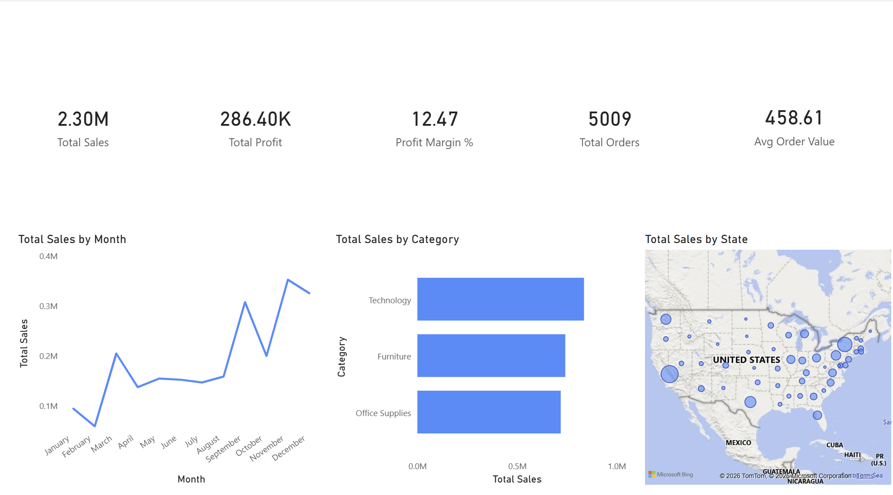
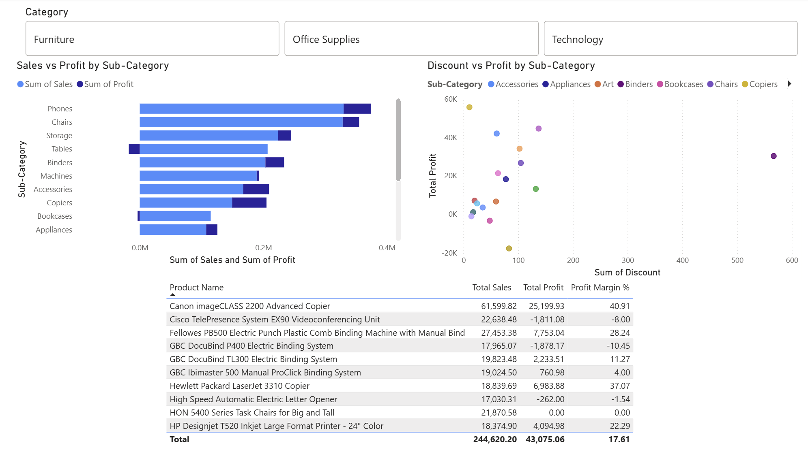
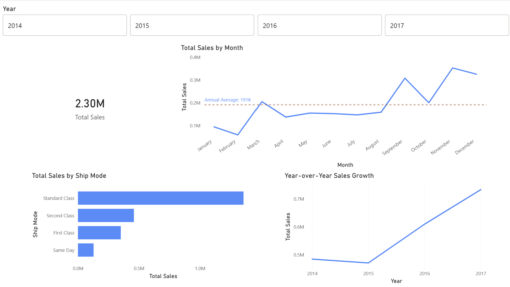
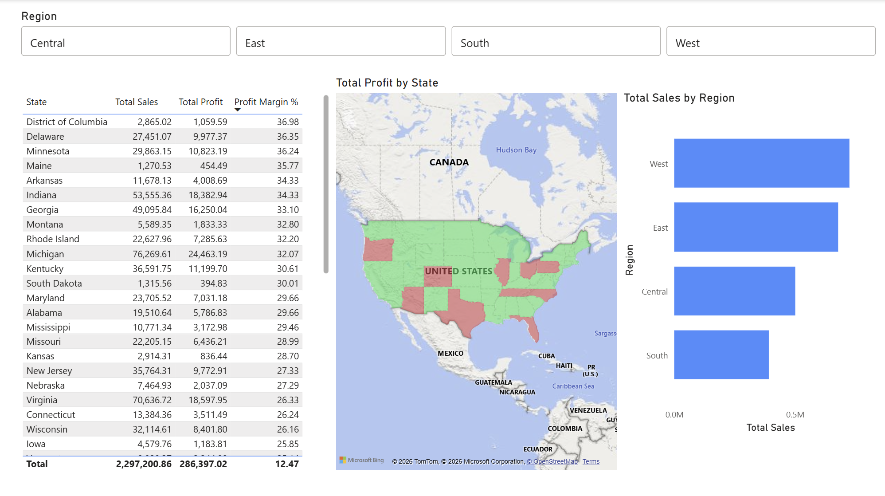

# Retail Sales Analysis Dashboard

**Tools:** Power BI, DAX  
**Data Source:** Superstore Sales Dataset (Kaggle - publicly available)  
**Records:** 9,994 orders | $2.3M in sales | 2014–2017  

---

## About This Project

This is a personal portfolio project I built to develop my Power BI and 
data analysis skills. I used a publicly available retail dataset and applied 
my background in retail operations and business management to go beyond 
just building charts - I focused on finding real business insights within 
the data.

The dashboard is designed to simulate the kind of reporting a retail 
operations manager or business analyst would present to senior leadership.

---

## Dashboard Pages

### 1. Executive Overview
High-level KPIs and performance summary for quick decision-making.
- Total Sales: $2.30M
- Total Profit: $286.40K
- Profit Margin: 12.47%
- Total Orders: 5,009
- Average Order Value: $458.61

### 2. Product & Margin Analysis
Deep dive into which products and sub-categories are driving or 
hurting profitability.
- Sales vs Profit by Sub-Category
- Discount vs Profit scatter plot
- Top product breakdown with margin %

### 3. Seasonal Trends
Understanding when sales peak and how the business has grown year over year.
- Monthly sales trend with average reference line
- Year-over-year growth (2014–2017)
- Sales by fulfillment/ship mode

### 4. Regional Performance
Geographic breakdown of where the business is profitable and where it 
is losing money.
- State-level profit map (green = profitable, red = losing money)
- Sales by region (West, East, Central, South)
- Full state-level table with Sales, Profit, and Margin %

---

## Key Findings

- **Tables sub-category is unprofitable** despite strong sales volume, 
  suggesting a pricing or discounting strategy issue that needs attention
- **November and December outperform** the monthly average by over 60%, 
  confirming the holiday season as the most critical sales window
- **Central region states like Texas and Illinois** show negative profit 
  margins despite high sales — heavy discounting is eroding profitability 
  in this region
- **Overall sales grew 56%** from 2014 to 2017, with the strongest growth 
  occurring in the 2016–2017 period

---

## Skills Demonstrated

- Data modeling and DAX measure creation in Power BI
- Multi-page dashboard design for executive storytelling
- Geographic data visualization using filled map visuals
- Identifying business insights from raw transactional data
- Connecting data analysis to real-world retail operations knowledge

---

## About Me

I am an MBA candidate at New Jersey City University specializing in 
Organizational Management and Leadership, with 4+ years of retail 
operations experience at Macy's. This project is part of my personal 
data analytics portfolio as I transition into business analyst and 
data-driven operations roles.

📧 marlonmieses02@gmail.com  
📍 Jersey City, NJ
